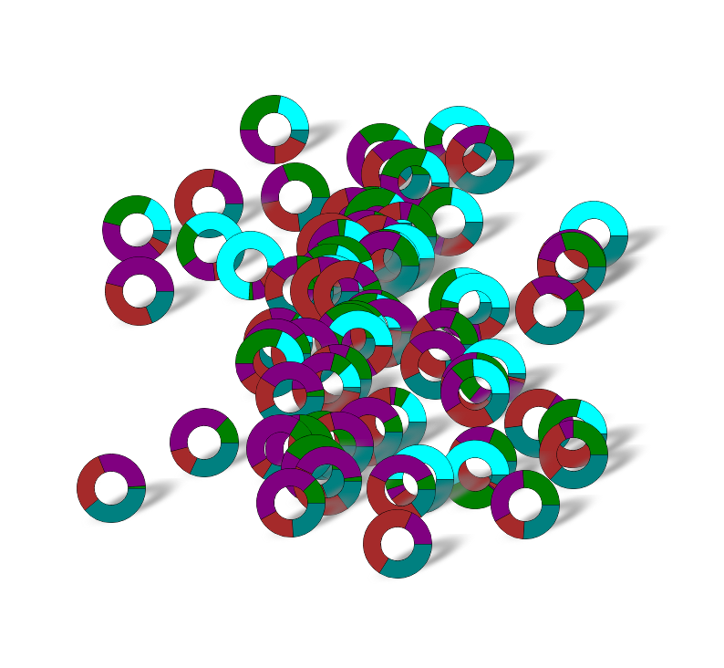
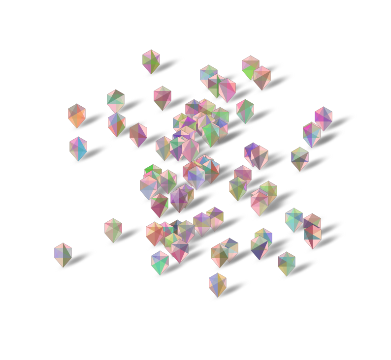

# QGIS: Generative Markers

A simple setup to render custom markers on a NodeJS server and then displaying them as Point-Symbols on a QGIS map.

## Author's comment
There is probably a way to generate those markers in a QGIS-Python function. But I really don't like QGIS-Python and the documentation is not really helpful. Sorry.

## Setup

```bash
npm install
```

## Start the Server

```
npm run serve
```

## Adding it to QGIS

So far i have three marker types, but when you look into the marker/*.js files, you can easily see how you could add other markers.

*Make sure the port number matches your setup!*

Tree marker:
```
http://localhost:3000/marker/tree/NUMBER
```

Donut marker (make sure the numbers add up to 100, its a very simple implementation):
```
http://localhost:3000/marker/tree/NUMBER,NUMBER,NUMBER
```

Generative Marker (because its randomly generated, in order to receive the same image for the same object, send a unique SEED, for example @id):
```
http://localhost:3000/marker/tree/NUMBER
```

## Style Modifications

When selecting the Raster Image, use the expression editor for the location to enter the url and add data:

```
concat('http://localhost:3000/marker/tree/', "count")
```

Make sure you also set the width and height of the image, in the examples all 150w, 100h and set the unit to pixels.

And to make the shadows look nice, you should order the markers by `y($geometry)` DESC.

The `qgis` folder holds an example project with the dataset.

## Preview 





## Loads of markers

If you have hundreds or thousands of markers you might obviously run into trouble. I have already written the express server to launch multiple instances to handle more load. But QGIS is caching all images, so once they are loaded you are fine. If for some reason an image is not properly shown, that is a problem, because QGIS will not request the image again. The easiest solution just add a little something to the URL:

```
concat('http://localhost:3000/marker/tree/', "count", '?v=1.1')
```

## Acknowledgement

The idea to overcome my QGIS-Python incompatibility with an external server came from [Johannes Kröger](https://hannes.enjoys.it/blog/)

The [markers](https://github.com/sebastian-meier/generative_marker) were written ages ago to be used in Leaflet/Mapbox
